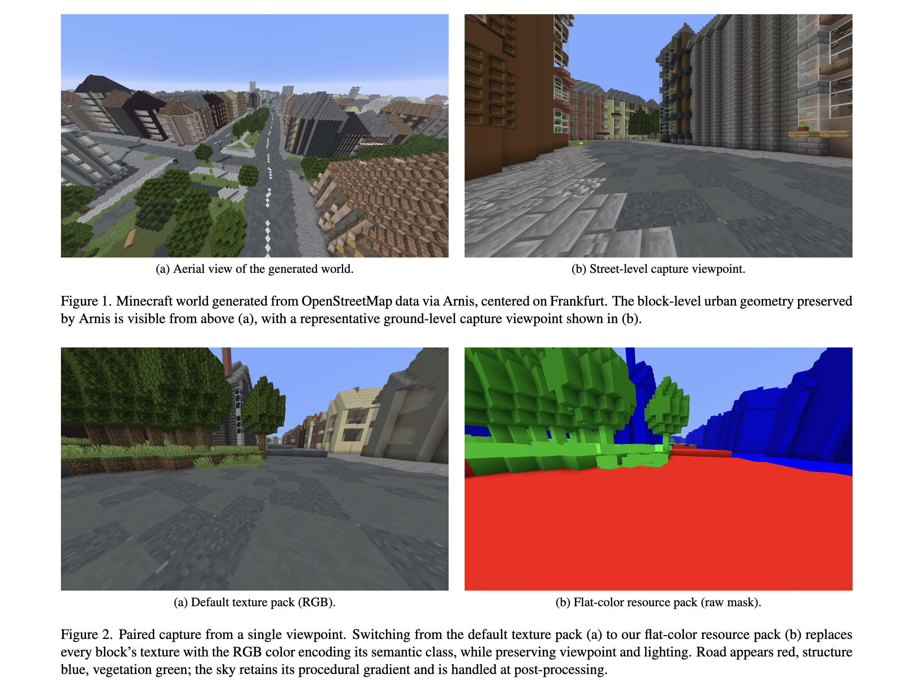

# minecraft-sim2real

Code for *"Minecraft for Semantic Segmentation: A Procedural Data Pipeline and Sim-to-Real
Analysis"* (MIT 6.S058, 2026). The paper is at [`docs/report.pdf`](docs/report.pdf).

A pipeline for generating semantic segmentation training data from procedural Minecraft
worlds, and an empirical study of low-fidelity sim-to-real transfer to Cityscapes.

## Overview

The pipeline has three stages:

1. **World generation** — [Arnis](https://github.com/louis-e/arnis) converts OpenStreetMap
   data into Minecraft worlds whose geometry mirrors a real city.
2. **Paired capture** — at each viewpoint, two screenshots are taken: one with the default
   texture pack (RGB image) and one with a custom flat-color resource pack (segmentation
   mask).
3. **Label post-processing** — raw color masks are converted to integer class maps via a
   per-pixel channel-dominance classifier.

The output is a directory of paired `(rgb_NNNN.png, mask_NNNN.png)` files, drop-in
compatible with any standard semantic segmentation training pipeline.



## Layout

```
main.py         pack / process / stats | train / evaluate / baseline | figures
pipeline/       blocks, labels, resource_pack, process
segformer/      config, data, remap, metrics, train, evaluate, plots
notebooks/      the training and evaluation narrative
results/        the numbers behind the tables below
figures/        as produced by the run the report was written from
docs/report.pdf
```

`pipeline/` never imports torch. Generating data, checking a dataset and rebuilding figures
run on a laptop; training and evaluation need a GPU and the datasets.

## Results

Per-class IoU and mean IoU, as in Table 2 of the report.

| Method | road | structure | vegetation | sky | mIoU |
|---|---|---|---|---|---|
| Minecraft (in-distribution val) | 0.91 | 0.87 | 0.93 | 0.94 | **0.91** |
| Minecraft → Cityscapes | 0.36 | 0.44 | 0.41 | 0.61 | **0.45** |
| ADE20K → Cityscapes (baseline) | 0.97 | 0.87 | 0.87 | 0.90 | **0.90** |

The model fits the Minecraft labels well and transfers poorly. Large position-defined
regions (sky, dominant structure) survive the domain shift; categories absent from the
synthetic source do not, and the model defaults to `structure` for them — it predicts
structure for 63% of road pixels and 57% of vegetation pixels on Cityscapes.

**The baseline comparison is generous to the baseline.** It emits 150 ADE20K classes, most
of which have no counterpart in the four-class scheme, and pixels where it predicts one of
those are dropped rather than counted as errors. Its numbers are computed on the **92.5%**
of labelled pixels that survived that filter, while ours are computed on all of them. Read
0.90 as an upper bound on what scene-parsing pretraining alone achieves here.

`results/` holds these at full precision, along with the 40-epoch training history from the
run the report was written from.

## Class scheme

Four classes plus an ignore label.

| Index | Class | Pack color | Pixel fraction |
|---|---|---|---|
| 0 | road | (255, 0, 0) | 20.7% |
| 1 | structure | (0, 0, 255) | 34.2% |
| 2 | vegetation | (0, 255, 0) | 33.7% |
| 3 | sky | not painted; recovered in post-processing | 11.2% |
| 255 | ignore | (0, 0, 0) | 0.2% |

`structure` is the catch-all for any block that is not road, vegetation or ignored — it
aggregates buildings, walls, fences and sidewalks, because the Minecraft block taxonomy
does not consistently distinguish them.

Sky is not painted by the resource pack: Minecraft renders it procedurally as a gradient.
It is the only thing in a mask with all three channels bright at once, which is how the
post-processing step recovers it.

## Reproducing the pipeline

Needs `numpy` and `Pillow`.

**1. Generate a world.** Follow [Arnis](https://github.com/louis-e/arnis) to build a
Minecraft world from an OpenStreetMap bounding box. The experiments use central Frankfurt,
which is also one of the cities in the Cityscapes validation set.

**2. Build the segmentation resource pack** from your own Minecraft client jar:

```bash
python main.py pack ~/Library/Application\ Support/minecraft/versions/1.21.11/1.21.11.jar
```

This writes `segmentation_pack/`, plus a `classification_log.txt` listing every block and
the class it was assigned. Move the pack into your `resourcepacks/` folder.

**3. Capture paired screenshots.** At each viewpoint: set time to noon (`/time set 6000`),
F2 for the RGB frame, swap to the segmentation pack, F2 for the mask, swap back. Hold
graphics settings fixed — Smooth Lighting maximum, See-Through Leaves off, Clouds off,
Particles minimal, Brightness bright, Texture Filtering none, Render Distance 32 chunks.

**4. Process them into a dataset:**

```bash
python main.py process ~/Library/Application\ Support/minecraft/screenshots data/dataset
python main.py stats data/dataset
```

`process` pairs screenshots in capture order, applies the channel-dominance classifier and
writes `rgb/`, `mask_color/`, `mask_label/` and `mask_check/`. Train on `mask_label`;
`mask_check` is a flat-color rendering for eyeballing a mask against its frame.

Pairing assumes capture alternated RGB then mask throughout. A stray screenshot offsets
every pair after it, so check `mask_check/` before training.

## Training and evaluation

Needs `torch`, `transformers==4.44.2`, `albumentations==1.4.14`, `matplotlib` and `tqdm`,
plus a GPU. Training takes about 30 minutes on an A100.

```bash
python main.py train data/dataset
python main.py evaluate data/cityscapes
python main.py baseline data/cityscapes
```

`data/cityscapes` is a Cityscapes root holding `leftImg8bit/val` and `gtFine/val`; it
requires a (free) account at [cityscapes-dataset.com](https://www.cityscapes-dataset.com/).
`evaluate` and `baseline` write to `results/`.

```bash
python main.py figures
```

rebuilds figures from `results/` alone, with no data and no GPU.

[`notebooks/segformer_minecraft.ipynb`](notebooks/segformer_minecraft.ipynb) runs the same
steps as a narrative. Its outputs are stripped; the numbers live in `results/` and the
figures in `figures/`.

Runs are seeded but not bit-reproducible: cuDNN kernel selection is left at its default, so
retraining will land near 0.91 rather than exactly on it.

## Example dataset

`data/example_dataset.zip` holds **10 paired RGB-mask frames** from the Frankfurt world, for
inspecting pipeline output without running the capture step. It is a sample, not a
representative one — the class balance in the table above is over all 300 frames.

## Limitations

Discussed in the paper:

- **Single-city collection** (Frankfurt only) limits geographic diversity.
- **Manual capture** limits scale and viewpoint coverage.
- **Structure aggregation** prevents distinguishing buildings from sidewalks, walls and fences.
- **No vehicles, pedestrians or urban furniture** — absent from Arnis-generated worlds, and
  the source of most of the transfer gap.
- **No domain adaptation.** The unadapted regime is measured deliberately, to isolate what
  transfers from Minecraft alone.

## Citation

```bibtex
@misc{vu2026minecraftsim2real,
  author = {Duong Vu},
  title  = {Minecraft for Semantic Segmentation: A Procedural Data Pipeline and Sim-to-Real Analysis},
  year   = {2026},
  howpublished = {\url{https://github.com/duongvu2005/minecraft-sim2real}},
}
```

## License

MIT — see [LICENSE](LICENSE). Minecraft is commercial software; you need your own client
jar to build the resource pack.

## Acknowledgments

- [Arnis](https://github.com/louis-e/arnis) — OpenStreetMap to Minecraft world conversion
- [OpenStreetMap](https://www.openstreetmap.org) — geographic data, under the Open Database License
- [SegFormer](https://github.com/NVlabs/SegFormer) — segmentation architecture and pretrained weights
- [Cityscapes](https://www.cityscapes-dataset.com/) — evaluation benchmark
- [ADE20K](https://groups.csail.mit.edu/vision/datasets/ADE20K/) — baseline pretraining
